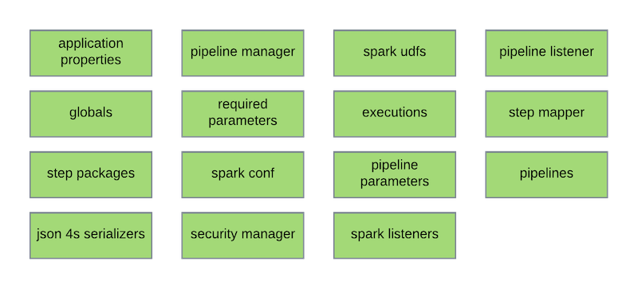

[Documentation Home](readme.md)

# Applications
An application is a container that provides everything required to execute a Spark job. The configuration is stored as 
JSON which will be parsed when the _spark-submit_ command invokes the main driver class.

## Spark Submit
When invoking the _spark-submit_ command, two things are required in order to run a custom application, a jar file and
a class. Metalus provides a [self contained jar](metalus-application.md) that may be used for the jar file and a default
class is provided: ```com.acxiom.pipeline.drivers.DefaultPipelineDriver``` 

The _DefaultPipelineDriver_ class requires an additional parameter named ```driverSetupClass```

This is an extension point where developers may customize how applications are loaded.

## Applicaton Driver Setup
The Metalus application framework provides a default implementation that may be used:
```com.acxiom.pipeline.applications.DefaultApplicationDriverSetup```

Developers wishing to provide custom application driver setup may extend this trait:
```com.acxiom.pipeline.applications.ApplicationDriverSetup```

This driver setup class will load an application JSON configuration and create the execution plan used by the
_DefaultPipelineDriver_ class to execute the Spark job. The following parameters are required:

* **applicationJson** - This parameter is useful when passing the contents of the configuration as a string. This is not 
a recommended option since large configurations could have issues.
* **applicationConfigPath** - This is the path to the configuration JSON. This may be a path on a file system or a URL to a REST API. 
* **applicationConfigurationLoader** - This optional parameter is used when the _applicationConfigPath_ is not a URL. A 
[FileManager](filemanager.md) implementation will be used to load files for a given path. By default the local file system
will be checked. An HDFS implementation is also provided in the core project and an S3 implementation is provided by the
metlaus-aws project. The value must be a fully qualified class name. All command line parameters will be used to try and
initialize the file manager.

### [Authorization](httprestclient.md#authorization)
* **authorization.class** - This is used to specify an authorization implementation when the _applicationConfigPath_ is
a URL. Any parameters required to instantiate the _Authorization_ instance need to be prefixed with _authorization._ so
they are identified and passed in. To use basic authorization, consider this class signature: 

### [CredentialProvider](credentialprovider.md)
This implementation overrides the default implementation provided by _DriverSetup_ to use the application globals object.
This allows developers the opportunity to override the default implementation using the _credential-provider_ global. The
does not _credential-provider_ may still be passed on the command line. The main purpose of this override is to allow 
credentials to be embedded in the application JSON instead of being passed on the command line.

## Configuration Sections
There are a number of sections that may be used to customize an application.



### Class Info
A special structure is used when overriding default classes such as:

* _pipelineListener_ - The main pipeline listener that will be notified during processing. If the _PipelineListener_ also 
implement the _SparkListener_ interface it will be registered with Spark.
* _sparkListeners_ - A list of classes that implement the _SparkListener_ interface to register with the Spark session.
* _securityManager_ - The _PipelineSecurityManager_ that is used when mapping parameters.
* _stepMapper_ - The _PipelineStepMapper_ to perform mapping prior to execution of pipeline steps.
* [pipelineManager](pipeline-manager.md) - Performs lookups based on pipeline ids. Parameters for the _PipelineManager_ will
attempt to parse objects and lists of objects.
* _sparkUdfs_ - A list of UDF classes to register with the Spark session.

Using any of the options listed requires a JSON object that contains two parameters:

* **className** - The fully qualified class name to load
* **parameters** - This is an object that contains attributes where the name matches the parameters of the constructor 
of the class. The parameters may also embed objects/list of objects using this same pattern.

### Application Properties
The application properties section provides a location to place data that may need to be used when setting up the 
execution plan. These properties will not be available during execution. The default implementation does not use these
properties.

### Globals
The globals object will be seeded with any parameters that have been provided after the jar file. These parameters need to
begin with two dashes (--) followed by a name , a space and the value. The library does not support parameters without 
values. Example: ```--myparam someValue --anotherparam anotherValue```

Any globals added in the application configuration will be added to the seed globals and made available to te executions.
Globals may be strings, numbers, arrays or objects. 

#### Objects
Globals attributes may contain JSON objects which will be converted into a Scala map unless the object contains two
attributes named _className_ and _object_. The library will attempt to instantiate the _case class_ with the values
stored in the _object_ attribute. The two attributes are *only required* for the top level object. Any objects embedded
will automatically get picked up as long as they are defined in the main object case class.

#### Arrays
Values of a global entry may be an array of any of the supported types except array. When embedding objects, refer to 
the object section above.

#### Example

```json
{
  "globals": {
    "number": 1,
    "float": 1.5,
    "string": "some string",
    "mappedObject": {
      "className": "com.acxiom.pipeline.applications.TestGlobalObject",
      "object": {
        "name": "Global Mapped Object",
        "subObjects": [
          {
            "name": "Sub Object 1"
          },
          {
            "name": "Sub Object 2"
          }
        ]
      }
    }
  }
}
```

### Step Packages
The step packages array provides a list of strings that are used when search for step functions. Any function that is used
and not in one of the listed packages will cause an error.

### Required Parameters
The required parameters array is a list of strings containing the names of all application parameters that are expected
to be provided to the command line. Any parameters not present will cause an exception to be thrown and the submission to 
fail.

#### Example
```json
{
  "requiredParameters": [
    "param1",
    "param2"
  ]
}
```

### Spark Conf
The _sparkConf_ section is a JSON object that allows developers to specify values that can be set on the _SparkConf_. Two
attributes are supported:

#### kryoClasses
This attribute is an array of string representing classes that should be serialized. Leaving this empty will use the 
default classes:

* "org.apache.hadoop.io.LongWritable",
* "org.apache.http.client.entity.UrlEncodedFormEntity"

#### setOptions
This array allows the developer to specify options to be passed to the SparkConf when it is created. Each object in the 
array needs to have a name attribute of the SparkConf option and a value attribute to pass to the _setOption_ call of the
_SparkConf_. Both values must be a string.

#### Example
```json
"sparkConf": {
"kryoClasses": [
  "org.apache.hadoop.io.LongWritable",
  "org.apache.http.client.entity.UrlEncodedFormEntity"
],
"setOptions": [
  {
    "name": "spark.hadoop.io.compression.codecs",
    "value": "org.apache.hadoop.io.compress.BZip2Codec,org.apache.hadoop.io.compress.DeflateCodec,org.apache.hadoop.io.compress.SnappyCodec,org.apache.hadoop.io.compress.GzipCodec"
  }
]
}
```

### Pipeline Parameters
This section allows the developer to optionally establish _runtime_ parameters for each pipeline.

#### Example
```json
"pipelineParameters": {
"parameters":[
  {
    "pipelineId": "Pipeline2",
    "parameters": {
      "howard": "johnson"
    }
  }
]
}
```

### Pipelines
The pipelines section should contain all pipelines that may be used by the executions. Executions may override pipelines
directly, but it is advised to place all pipelines in this section and use the _pipelineIds_ array in the execution which
will invoke the [PipelineManager](pipeline-manager.md) to fetch the pipeline.

**Note:** When overriding the _PipelineManager_, it is advised that executions use _pipelineIds_ and not rely on the 
_pipelines_ array.

### Executions
The executions array contains definitions for how pipelines should be executed as well as dependencies. In addition to 
the execution instructions, each execution has the ability to override the classes and settings defined in the 
application configuration as well as override default settings.

Below is a list of configuration items:

* **id** - A an id that is unique with this application configuration file.
* **pipelineIds** - A list of pipeline ids to execute in provided order. If the pipeline is not part of the _pipelines_ 
array then the application pipelines will be checked and then finally the classpath will be checked.
* **initialPipelineId** - Which pipeline should the processing begin with.
* **parents** - An array containing the _id_s of executions that this execution is dependent upon.


Below is a list of overrides:

* **globals** - The develop may choose to define custom globals for an execution that differs from the application level 
or using the _mergeGlobals_ boolean attribute, merge these globals with the application globals.
* **pipelines** - Define which pipelines to execute. This will override the application level pipelines with the same id.
* **pipelineListener** - Override the application defined or default _PipelineListener_.
* **sparkListeners** - Add additional _SparkListener_s for this execution.
* **securityManager** - Override the application defined or default _PipelineSecurityManager_.
* **stepMapper** - Override the application defined or default _PipelineStepMapper_.
* **pipelineParameters** - Override the application defined or default _PipelineParameters_.
