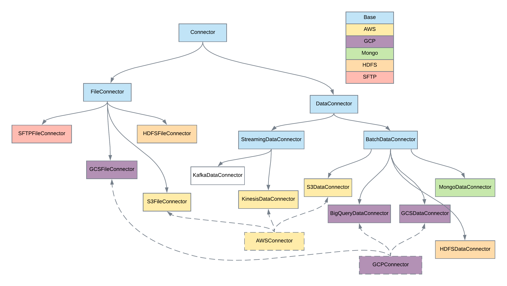

[Documentation Home](readme.md)

# Connectors
Connectors provide an abstraction for working with data. Connectors are designed to be modeled as JSON to easily include
in [applications](applications.md), [pipelines](pipelines.md) and [steps](steps.md). Each implementation implement
functions that will be used by steps to work with data in a generic manner.

## File Connectors
File Connectors are designed to operate with a single file. These connectors provide access to [FileManager](filemanager.md)
implementation for the specified file system. More information can be found [here](fileconnectors.md).
## Data Connectors
Data Connectors provide an abstraction for loading and writing data. The provided functions work specifically on DataFrames.
More information can be found [here](dataconnectors.md).
