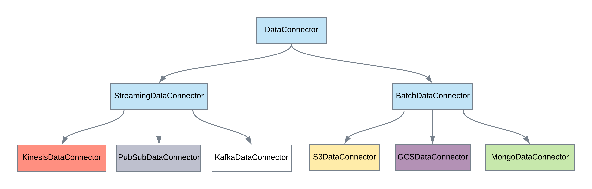

[Documentation Home](readme.md)

# Data Connectors
Data Connectors provide an abstraction for loading and writing data. This is useful for creating generic pipelines that
can used across providers without source/destination knowledge prior to runtime. Each connector has the responsibility
to load and write a DataFrame based on the underlying system. Below is a breakdown of how connectors may be classified:



**Parameters**
The following parameters are available to all data connectors:

* **name** - The name of the connector
* **credentialName** - The optional credential name to use to authenticate
* **credential** - The optional credential to use to authenticate
* **readOptions** - The optional read options to use when loading the DataFrame
* **writeOptions** - The optional write options to use when writing the DataFrame

## Batch
Connectors that are designed to load and write data for batch processing will extend the _BatchDataConnector_. These
are very straightforward and offer the most reusable components.

### HDFSDataConnector
This connector provides access to HDFS. The _credentialName_ and _credential_ parameters are not used in this implementation,
instead relying on the permissions of the cluster. Below is an example setup:

#### Scala
```scala
val connector = HDFSDataConnector("my-connector", None, None,
        DataFrameReaderOptions(format = "csv"),
        DataFrameWriterOptions(format = "csv", options = Some(Map("delimiter" -> "þ"))))
```
#### Globals JSON
```json
{
  "connector": {
    "className": "com.acxiom.pipeline.connectors.HDFSDataConnector",
    "object": {
      "name": "my-connector",
      "readOptions": {
        "format": "csv"
      },
      "writeOptions": {
        "format": "csv",
        "options": {
          "delimiter": "þ"
        }
      }
    }
  }
}
```
### S3DataConnector
This connector provides access to S3. Below is an example setup that expects a secrets manager credential provider:
#### Scala
```scala
val connector = S3DataConnector("my-connector", Some("my-credential-name-for-secrets-manager"), None,
        DataFrameReaderOptions(format = "csv"),
        DataFrameWriterOptions(format = "csv", options = Some(Map("delimiter" -> "þ"))))
```
#### Globals JSON
```json
{
  "connector": {
    "className": "com.acxiom.aws.pipeline.connectors.S3DataConnector",
    "object": {
      "name": "my-connector",
      "credentialName": "my-credential-name-for-secrets-manager",
      "readOptions": {
        "format": "csv"
      },
      "writeOptions": {
        "format": "csv",
        "options": {
          "delimiter": "þ"
        }
      }
    }
  }
}
```
### GCSDataConnector
This connector provides access to GCS. Below is an example setup that expects a secrets manager credential provider:
#### Scala
```scala
val connector = GCSDataConnector("my-connector", Some("my-credential-name-for-secrets-manager"), None,
        DataFrameReaderOptions(format = "csv"),
        DataFrameWriterOptions(format = "csv", options = Some(Map("delimiter" -> "þ"))))
```
#### Globals JSON
```json
{
  "connector": {
    "className": "com.acxiom.gcp.pipeline.connectors.GCSDataConnector",
    "object": {
      "name": "my-connector",
      "credentialName": "my-credential-name-for-secrets-manager",
      "readOptions": {
        "format": "csv"
      },
      "writeOptions": {
        "format": "csv",
        "options": {
          "delimiter": "þ"
        }
      }
    }
  }
}
```
### BigQueryDataConnector
This connector provides access to BigQuery. Below is an example setup that expects a secrets manager credential provider:
#### Scala
```scala
val connector = BigQueryDataConnector("temp-bucket-name", "my-connector", Some("my-credential-name-for-secrets-manager"), None,
        DataFrameReaderOptions(format = "csv"),
        DataFrameWriterOptions(format = "csv", options = Some(Map("delimiter" -> "þ"))))
```
#### Globals JSON
```json
{
  "connector": {
    "className": "com.acxiom.gcp.pipeline.connectors.BigQueryDataConnector",
    "object": {
      "name": "my-connector",
      "credentialName": "my-credential-name-for-secrets-manager",
      "tempWriteBucket": "temp-bucket-name"
    }
  }
}
```
### MongoDataConnector
This connector provides access to Mongo. Security is handled using the uri or a _UserNameCredential_. In addition to
the standard parameters, the following parameters are available:

* **uri** - The name connection URI
* **collectionName** - The name of the collection

#### Scala
```scala
val connector = MongoDataConnector("mongodb://127.0.0.1/test", "myCollectionName", "my-connector", Some("my-credential-name-for-secrets-manager"), None,
        DataFrameReaderOptions(format = "csv"),
        DataFrameWriterOptions(format = "csv", options = Some(Map("delimiter" -> "þ"))))
```
#### Globals JSON
```json
{
  "connector": {
    "className": "com.acxiom.metalus.pipeline.connectors.MongoDataConnector",
    "object": {
      "name": "my-connector",
      "credentialName": "my-credential-name-for-secrets-manager",
      "uri": "mongodb://127.0.0.1/test",
      "collectionName": "myCollectionName"
    }
  }
}
```
## Streaming
Streaming connectors offer a way to use pipelines with [Spark Structured Streaming](https://spark.apache.org/docs/latest/structured-streaming-programming-guide.html) without 
the need to write new [drivers](pipeline-drivers.md). When designing pipelines for streaming, care must be taken to not
inject steps that are more batch oriented such as doing a file copy.

### KinesisDataConnector
This connector provides access to Kinesis. In addition to the standard parameters, the following parameters are
available:

* **streamName** - The name of the Kinesis stream.
* **region** - The region containing the Kinesis stream
* **partitionKey** - The optional static partition key to use
* **partitionKeyIndex** - The optional field index in the DataFrame row containing the value to use as the partition key
* **separator** - The field separator to use when formatting the row data

Below is an example setup that expects a secrets manager credential provider:
#### Scala
```scala
val connector = KinesisDataConnector("stream-name", "us-east-1", None, Some(15), ",", "my-connector",
  Some("my-credential-name-for-secrets-manager"))
```
#### Globals JSON
```json
{
  "connector": {
    "className": "com.acxiom.aws.pipeline.connectors.KinesisDataConnector",
    "object": {
      "name": "my-connector",
      "credentialName": "my-credential-name-for-secrets-manager",
      "streamName": "stream-name",
      "region": "us-east-1",
      "separator": ","
    }
  }
}
```
### KafkaDataConnector
This connector provides access to Kinesis. In addition to the standard parameters, the following parameters are
available:

* **topics** - The name of the Kinesis stream.
* **kafkaNodes** - The region containing the Kinesis stream
* **key** - The optional static key to use
* **keyField** - The optional field name in the DataFrame row containing the value to use as the key
* **separator** - The field separator to use when formatting the row data
* 
Below is an example setup that expects a secrets manager credential provider:
#### Scala
```scala
val connector = KafkaDataConnector("topic-name1,topic-name2", "host1:port1,host2:port2", "message-key", None,
  "my-connector", Some("my-credential-name-for-secrets-manager"))
```
#### Globals JSON
```json
{
  "connector": {
    "className": "com.acxiom.kafka.pipeline.connectors.KafkaDataConnector",
    "object": {
      "name": "my-connector",
      "credentialName": "my-credential-name-for-secrets-manager",
      "topics": "topic-name1,topic-name2",
      "kafkaNodes": "host1:port1,host2:port2",
      "key": "message-key"
    }
  }
}
```
