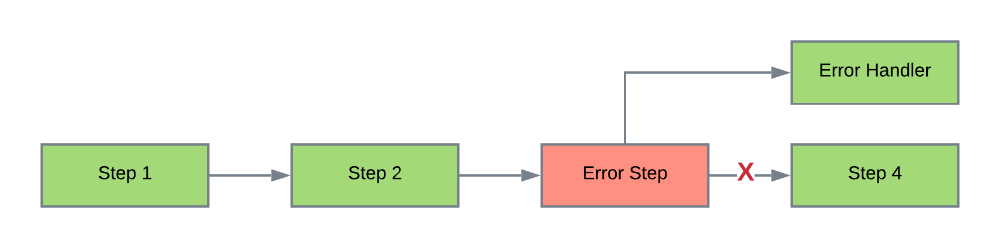
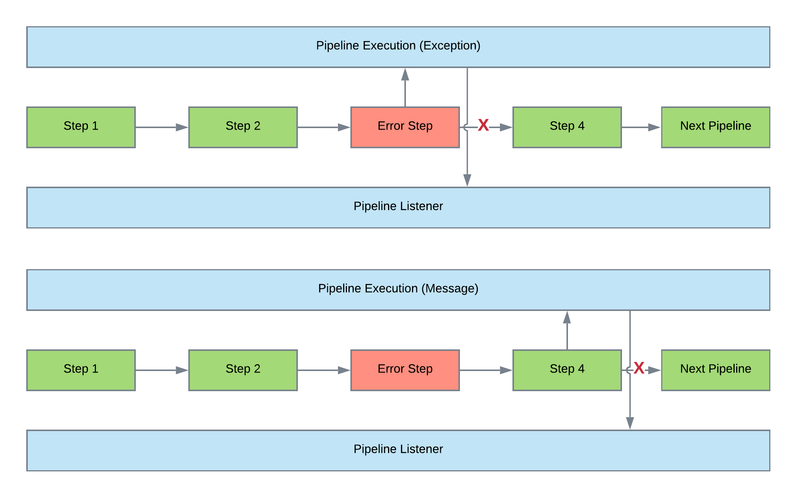

[Documentation Home](readme.md)

# Error Handling
Metalus provides several mechanisms for handling errors. Each method provides different behaviors and should be used 
together to provide a comprehensive solution.
## Execution Result Handling
The _DriverSetup_ trait provides the function _handleExecutionResult_ which is called by the driver upon completion
of an execution plan. The default behavior will scan the results of the execution looking for any exceptions not
handled by the application. The application parameters _maxRetryAttempts_ can be used to retry an execution if it fails 
but does not have an unhandled exception. The default is 0. The application parameter _terminateAfterFailures_ can be 
used to indicate an exception should be thrown when all retries are exhausted. The default is false indicating the 
application should stop running. Developers wishing to change this behavior can provide a custom [DriverSetup](pipeline-drivers.md#driversetup).

## Next Step Error Handling
A step which defines the _nextStepOnError_ attribute will force the execution of the defined step id instead of the 
normal execution path. A PipelineStepException will be set as the PrimaryStepResponse for the failed step. Normal
execution will proceed from the defined error handling step. The primary response of the step in error will be the
exception and can be accessed using the _LastStepId_ variable. This method of handling errors is useful when the pipeline
needs to perform some cleanup, the exception needs to be parsed, or a different execution path needs to be followed.

The flow depicted below shows how the _nextStepOnError_ would fow for a simple pipeline. The first two steps (1 and 2)
both execute normally and invoke _Error Step_. The  _Error Step_ will throw an exception which will invoke the
_Error Handler_ step and then complete the pipeline. _Step 4_ will never be executed when there is an exception. Metalus
will consider this as a successful execution.

## Pipeline Exceptions
Metalus uses the _PipelineStepException_ trait as the base for application exceptions. Any exception that extends
the _PipelineStepException_ trait will automatically be handled by Metalus. Pipeline exceptions stop the 
pipeline from processing at the specific step where the issue occurred. There are three implementations provided each with
different behaviors:

* [PipelineException](#pipelineexception)
* [PauseException](#pauseexception)
* [ForkedPipelineStepException](#forkedpipelinestepexception)

Developers should extend these exceptions to provide more specific information.

The flow below shows the difference between how an exception versus a message stops processing. The top flow
shows how an exception will stop processing in the middle of a pipeline. The bottom flow shows how using a
step message will allow the pipeline to complete, but not execute the next pipeline in the chain. In both
flows, the PipelineListener will be called with the exception. 

### PipelineException
This exception is the most common and is used to stop processing and indicate an application error has occurred. The
_retry_ behavior defined by [exception result handling](#execution-result-handling) will tag this execution as failed.
### PauseException
This exception is similar to the [pipeline exception](#pipelineexception) except that it will flag the result as paused
and be treated as a successful application execution.
### ForkedPipelineStepException
This exception will be thrown by fork blocks. Each exception thrown within the fork block will be captured and grouped.
The exceptions will be logged, and the execution flagged as failed to be handled like the [pipeline exception](#pipelineexception).
### Step Messages
Step messages will be evaluated **after each pipeline** in the chain have completed without throwing an exception. The _error_
and _pause_ type messages will throw an exception using the message as the exception message. The _error_ type will throw
a [pipeline exception](#pipelineexception) while the _pause_ type will throw a [pause exception](#pauseexception). This 
method of error handling is useful when the pipeline should complete, but processing should be stopped.
### Pipeline Listener
Any exception thrown during the execution of the pipeline will be registered with the _PipelineListener_ _registerStepException_
function.
