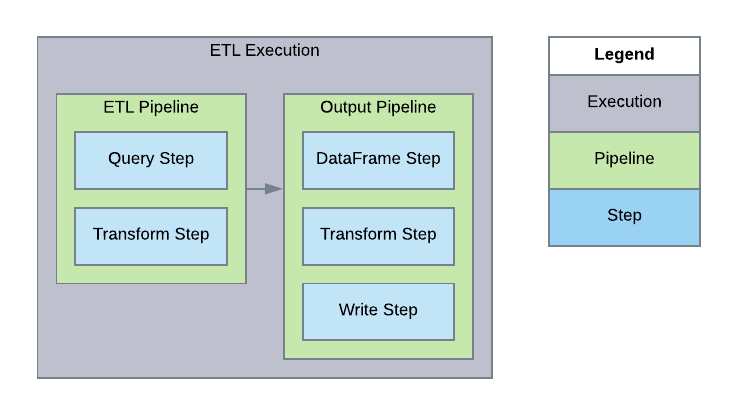

[Documentation Home](readme.md)

# Executions
An execution is a body of work within a Metalus [application](applications.md). An execution defines which 
[pipelines](pipelines.md) are executed and the proper context.

A single execution may run one or more pipelines in the order they are listed. As each pipeline completes, the status is
evaluated and a determination is made as to whether the next pipeline should be run.

In addition to executing pipelines, an execution may be dependent on zero, one or more other executions. When a 
dependency exists, the execution will wait until all _parent_ executions complete with a favorable status before
executing.
