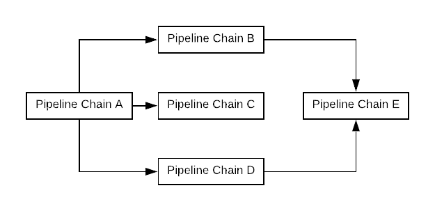

[Documentation Home](readme.md)

# Executions
An execution is a body of work within a Metalus [application](applications.md). An execution defines which 
[pipelines](pipelines.md) are executed and the proper context.


A single execution may run one or more pipelines in the order they are listed. As each pipeline completes, the status is
evaluated and a determination is made as to whether the next pipeline should be run. 

In addition to executing pipelines, an execution may be dependent on zero, one or more other executions. Executions may
run in parallel or be dependent on other executions. When a dependency exists, the execution will wait until all _parent_ 
executions complete with a favorable status before executing.



When one execution has a dependency on one or more executions, the *globals* and *parameters* objects will be taken from the final 
[PipelineContext](pipeline-context.md) and injected into the globals object of the child executions _PipelineContext_. Values
may be accessed using the following mapping syntax:

Access the primary return of a step:
```json
!<executionId>.pipelineParameters.<pipelineId>.<stepId>.primaryReturn
```

Access the secondary return of a step:
```json
!<executionId>.pipelineParameters.<pipelineId>.<stepId>.namedReturn
```

Access the secondary return named value of a step:
```json
!<executionId>.pipelineParameters.<pipelineId>.<stepId>.namedReturn.<valueName>
```

Access a global:
```json
!<executionId>.globals.<globalName>
```

In the event that the result of an execution plan results in an exception or one of the pipelines being paused or errored,
then downstream executions will not run.

## Execution Flow

