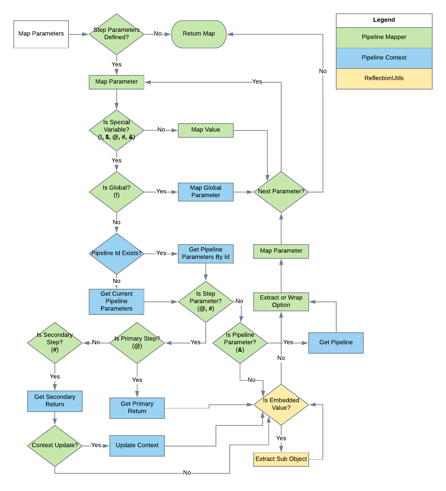

[Documentation Home](readme.md)

# Pipeline Mapping
Metalus strives to make pipelines reusable by allowing [pipeline step](pipeline-steps.md) parameters to be mapped at
runtime. This allows the [execution flow of the pipeline](pipeline-flow.md) to operate independently of data being used 
by the steps. In order to abstract the pipeline definition in a way that allows reuse without having to duplicate the 
metadata, Metalus has the concept of pipeline step mapping using a implementation of the _PipelineStepMapper_ class.

This flow demonstrates the mapping flow:



Special characters are allowed in the *value* of the parameter that the executor will use to determine where to pull 
the mapped value. The value may be static or dynamic. Below is a list of characters to use when the value should be 
dynamic:

* **!** - When the value begins with this character, the system will search the globals for the named parameter and pass 
that value to the step function.
* **$** - When the value begins with this character, the system will search the parameters for the named parameter and 
pass that value to the step function.
* **@** - When the value begins with this character, the system will search the parameters for the named parameter and 
pass the primaryReturn value to the step function.
* **#** - When the value begins with this character, the system will search the parameters for the named parameter and 
pass the namedReturns value to the step function. Embedded object mapping may be used here to directly access a single 
named value.
* **&** - When the value begins with this character, the system will search the pipelineManager for the named parameter 
and pass the pipeline or None to the step function. This is usually used in a step-group.

The **@** and **#** symbols are shortcuts that assume the value in parameters is a PipelineStepResponse.
 
In addition to searching the parameters for the current pipeline, the user has the option of specifying a pipelineId in 
the syntax for *@* and *$* to specify any previous pipeline value. *Example: @p1.StepOne*

## Embedded Values
Values may also be embedded. The user has the option to reference properties embedded in top level objects. Given an 
object (obj) that contains a sub-object (subObj) which contains a name, the user could access the name field using this
syntax:
```
$obj.subObj.name
```
	
Here is the object descried as JSON:
```json
{
	"subObj": {
		"name": "Spark"
	}
} 
```

**Embedded Values and String Concatenation**

The mapper also allows special values to be concatenated together in a parameter value. The special value must be wrapped
in curly braces "{}". As an example, given the following string 
```
"some_string-${pipelineId.subObj.name}-another_string"
 ```
would return 
```
"some_string-Spark-another_string"
```
Multiple values may be embedded as long as the resulting value is a string, boolean
or number. A return value of an object will log a warning and ignore string concatenation to return the object value.

## JSON Objects

JSON object values may also be embedded as a pipeline step value. Two attributes must be provided in the JSON, 
*className* and *object*. The *className* must be the fully qualified name of the case class to initialize and
it must be on the classpath. *object* is the JSON object to use to initialize the case class. 

Below is the syntax:

```json
{
  "className": "com.acxiom.pipeleine.ParameterTest",
  "object": {
  	"string": "some string",
  	"num": 5
  }
}
```

List values may be embedded as a pipeline step value. Support for variable expansion is available for maps and objects 
if the *className* property has been set.

Syntax for a list of objects:

```json
{
	"className": "com.acxiom.pipeleine.ParameterTest",
	"value": [
		{
			"string": "some string",
			"num": 5
		},
		{
        	"string": "some other string",
        	"num": 10
        }
	]
}
```

Syntax for a list of maps:

```json
{
	"value": [
		{
			"string": "some string",
			"num": 5
		},
		{
        	"string": "some other string",
        	"num": 10
        }
	]
}
```

JSON objects, maps and list of maps/objects can use the special characters defined above. This allows referencing dynamic 
values in predefined objects. Using the application framework, note that globals cannot use *@* or *#* since steps will 
not have values prior to initialization.

## Parameter Validation
Step parameter type checking can be enabled by providing the passing the option "validateStepParameterTypes true" as a global parameter.
This validation is disabled by default.

## Alternate Value Mapping
Metalus allows a step parameter mapping to have more than one value. The most common use case is having a single step
resolve the different outcomes of a branch step. Depending on the path that was taken, the primary mapped value may not
exist. In this case, Metalus will check the next mapped value until it finds a match or throws an error.

Example syntax:

```
@STEP_ONE || @STEP_TWO || !SOME_GLOBAL || default string
```

In the example above, Metalus will first attempt tp map the primary output of *STEP_ONE*, failing to find  a value, it
will check for the output of *STEP_TWO*, failing to find that it will search the _globals_ map for *SOME_GLOBAL* and
finally use the provided static text of _default string_.

## Pipeline Context Updates
Once advanced feature of Metalus is to allow steps the ability to update _PipelineContext_ using the secondary returns.
More information may be found [here](advanced-step-features.md).
