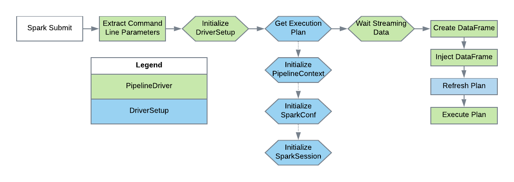

[Documentation Home](readme.md)

# Pipeline Drivers
Pipeline drivers are the entry point for any Metalus application. A default and Kafka based (streaming) drivers are 
provided. The pipeline driver chosen requires a *DriverSetup* to configure the application prior to execution.

## DriverSetup
The *DriverSetup* is invoked by the chosen driver class with a map containing all of the application command line 
parameters from the 'spark-submit' command. The *DriverSetup* will then be responsible for creating the *SparkSession*, 
*PipelineContext* and execution plan. When executing the 'spark-submit' class, one application parameter is required, 
*driverSetupClass* which is used to initialize the *DriverSetup* implementation.

This flow demonstrates how the chosen driver interacts with the *DriverSetup*:


There are no special instructions for creating the *SparkSession*. Both the *SparkSession* and *SparkConf* are required
by the [PipelineContext](pipeline-context.md).

### CredentialProvider
The _DriverSetup_ is responsible for provider a [CredentialProvider](credentialprovider.md) that may be used by the driver
to obtain any required credentials.

### Logging Parameters 
There are several command line parameters provided to help control the application log levels:

* **logLevel** - This parameter will set the log level for all Metalus classes. Standard log4j levels are used. Default
is _INFO_.
* **rootLogLevel** - This parameter controls the global logging level. Default is _WARN_.
* **customLogLevels** - This parameter allows controlling log levels for different packages. Example:

```shell script
--customLogLevels com.test:INFO,com.another.test:DEBUG,org.apache:WARN
```

## DriverSetup - Streaming
Using Spark Streaming API, additional drivers provide streaming functionality. As data is consumed, it is converted to a 
DataFrame and the pipelines are executed to process the data. Application developers will need to create a step that 
processes the DataFrame to perform additional conversions that *may* be required before processing with existing steps.

In addition to the basic DriverSetup functions mentioned in the Metalus Pipeline Core, streaming applications should
override the *refreshExecutionPlan* function. This function will be called prior to invoking the execution plan and 
gives the application a chance to reset any values in the context prior to processing data.

This flow demonstrates how the chosen driver interacts with the *DriverSetup*:



### Streaming Data Parsers
The default behavior of the provided streaming drivers when creating a data collection is to populate three fields: 
topic, key and value. The pipeline is responsible for retrieving the value for each row and parsing. This behavior can
be overridden by using the _StreamDataParsers_ trait. This trait provides two functions: _canParse_ and _parseRDD_. Both
functions take the RDD provided by the streaming driver. The _canParse_ function is used by the driver to identify which
parser to use when more than one parser is available. The _parseRDD_ function is called to create the DataFrame. Additional
parsers are provided by using the _streaming-parsers_ command line parameter and providing a comma separated list containing
the fully qualified classname of the parsers to use.
