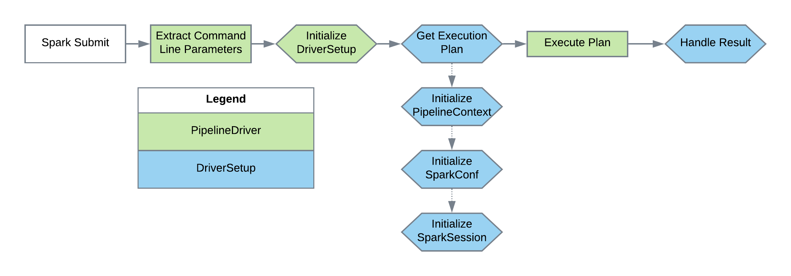

[Documentation Home](readme.md)

# Pipeline Drivers
Pipeline drivers are the entry point for any Metalus application. A default and Kafka based (streaming) drivers are 
provided. The pipeline driver chosen requires a *DriverSetup* to configure the application prior to execution.

## DriverSetup
The *DriverSetup* is invoked by the chosen driver class with a map containing all of the application command line 
parameters from the 'spark-submit' command. The *DriverSetup* will then be responsible for creating the *SparkSession*, 
*PipelineContext* and execution plan. When executing the 'spark-submit' class, one application parameter is required, 
*driverSetupClass* which is used to initialize the *DriverSetup* implementation.

This flow demonstrates how the chosen driver interacts with the *DriverSetup*:

There are no special instructions for creating the *SparkSession*. Both the *SparkSession* and *SparkConf* are required
by the [PipelineContext](pipeline-context.md).

## DriverSetup - Streaming
Using Spark Streaming API, additional drivers provide streaming functionality. As data is consumed, it is converted to a 
DataFrame and the pipelines are executed to process the data. Application developers will need to create a step that 
processes the DataFrame to perform additional conversions that *may* be required before processing with existing steps.

In addition to the basic DriverSetup functions mentioned in the Metalus Pipeline Core, streaming applications should
override the *refreshExecutionPlan* function. This function will be called prior to invoking the execution plan and 
gives the application a chance to reset any values in the context prior to processing data.

This flow demonstrates how the chosen driver interacts with the *DriverSetup*:

## KafkaPipelineDriver
This driver provides basic support for streaming data from [Kafka](http://kafka.apache.org/) topics. As data is consumed,
the RDD will be converted into a DataFrame with three columns:

* **key** - the record key
* **value** - the data
* **topic** - The topic the data arrived on

### Command line parameters
*Required parameters:*
* **driverSetupClass** - This class will handle all of the initial setup such as building out pipelines, creating the PipelineContext.
* **topics** - a comma separated list of topics to monitor
* **kafkaNodes** - a comma separated list of Kafka brokers to consume data

*Optional Parameters:*
* **duration-type** - [minutes | **seconds**] Corresponds to the *duration* parameter.
* **duration** - [number] How long the driver should wait before processing the next batch of data. Default is 10 seconds.
* **groupId** - [string] This is the group id where the Kafka consumer should listen
* **terminationPeriod** - [number] The number of ms the system should run and then shut down.
