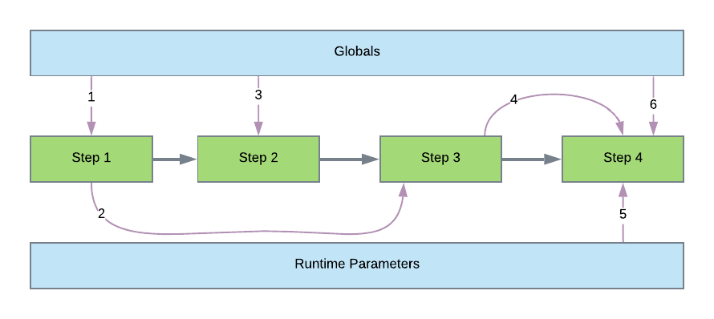
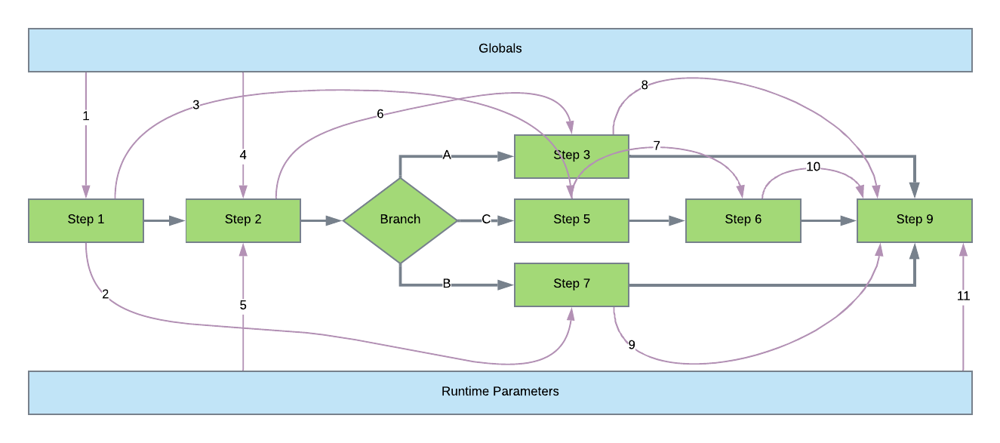

[Documentation Home](readme.md)

# Pipeline Execution and Data Flow
The order that pipeline steps execute is independent of the data flow. As each step executes, it may or may not use the
output of the previous step. The only hard requirement is that a step may **not** reference the output of a step that has
not executed.

## Basic Step Flow
Below is an example of a pipeline containing four steps, globals and runtime parameters. The main path arrows in gray 
illustrate the execution flow, while the purple arrows illustrate how data is mapped during execution.

### Execution Flow
* _Step 1_
* _Step 2_
* _Step 3_
* _Step 4_

### Data Flow
1. _Step 1_ has data mapped from _globals_.
2. _Step 3_ has the output of _Step 1_ mapped as input.
3. _Step 2_ has data mapped from _globals_.
4. The output of _Step 3_ is mapped to the input of _Step 4_.
5. One or more _runtime parameters_ will be mapped to the input of _Step 4_.
6. One ore more _globals_ will be mapped to the input of _Step 4_.

## Branch Step Flow
The separation of execution and data flow is easier to illustrate with a more complex example. Below is a pipeline that
contains a branch step. The main path arrows in gray illustrate the execution flow, while the purple arrows illustrate 
how data is mapped during execution.

### Execution Flow
* _Step 1_
* _Step 2_
* The branch step will choose one of three paths.

#### Path A
* _Step 3_
#### Path B
* _Step 7_
#### Path C
* _Step 5_
* _Step 6_
#### Final Step
* _Step 9_

### Data Flow
1. _Step 1_ has data mapped from _globals_.
2. _Step 7_ has the output of _Step 1_ mapped as input.
3. _Step 5_ has the output of _Step 1_ mapped as input.
4. _Step 2_ has data mapped from _globals_.
5. _Step 2_ has data mapped from _runtime parameters_.
6. _Step 3_ has the output of _Step 2_ mapped as input.
7. _Step 6_ has the output of _Step 5_ mapped as input.
8. _Step 9_ has the output of _Step 3_ mapped as input.
9. _Step 9_ has the output of _Step 7_ mapped as input.
10. _Step 9_ has the output of _Step 6_ mapped as input.
11. _Step 9_  has data mapped from _runtime parameters_.

Items 8, 9 and 10 may all be mapped to that step or may use [alternate value mapping](parameter-mapping.md#alternate-value-mapping) to map the output of the step that
actually got executed.
