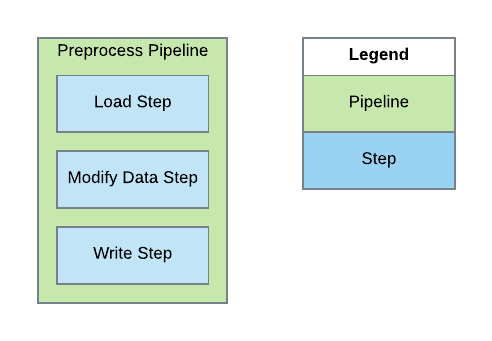

[Documentation Home](readme.md)

# Pipelines
Metalus pipelines represent a unit of work within a Metalus [execution](executions.md). Pipelines may run by themselves 
or run chained together with other pipelines within an execution. The basic structure of a pipeline consists of an
id, name, category and a list of steps to execute.

* **id** - A unique id for the pipeline. A GUID is recommended.
* **name** - A displayable name that will be used when logging.
* **category** - The type of pipeline:
    * **pipeline** - This is the base pipeline that gets executed.
    * **step-group** - This designates that the pipeline is designed to be included within a [Step Group](step-groups.md).
* **steps** - A list of [pipeline steps](pipeline-steps.md) to be executed.

The steps list consists of the _pipeline steps_ which will be executed as part of the pipeline. Below is an overview of 
a basic pipeline: 

## Pipeline Execution Flow

