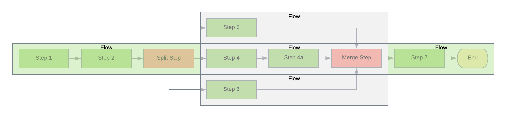
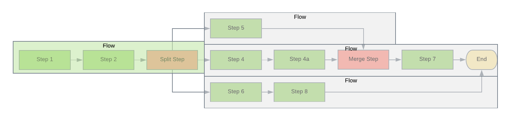

[Documentation Home](readme.md)

# Split/Merge
The split and merge step types allow pipeline designers the ability to run different step sequences in parallel. The
merge step is used to indicate where the executions should stop and normal processing resume.

## Split
The split step allows different paths within a pipeline to execute in a parallel manner. Unlike the [fork step](fork-join.md)
where all the executed steps are the same, the split step allows different steps to be executed.

* **id** - The id of this step in the pipeline
* **type** - This should always be "split"
* **params** - The split only allows _result_ parameter types. Like the branch step, each result will act as the **nextStepId**.
* **nextStepId** - This **must** be empty

## Merge
The merge step is used to mark the end of a split flow. No special handling occurs, but any step that is executed after
the merge will be able to map values from previously executed steps. Only the split flow(s) that have executed will be 
available.

The merge step only requires two parameters:
*  **id** - The id of this step in the pipeline
* **type** - This should always be "merge"

## Simple Flow
The diagram below depicts a split step which results in three different paths which are _merged_ before continuing the
main flow. Steps 1, 2, Split and 7 are considered part of the main flow. Steps 4 (including 4a), 5 and 6 will all execute
in parallel as individual flows until the _Merge_ step is reached. Once the three flows complete, step 7 will be executed
and output from all three flows will be available.

## Complex Flow
This diagram depicts a split step which results in three different paths being created. Steps 1, 2 and Split are all part
of the main flow. Steps 4 (including 4a), 5 and 6 will be execute in parallel as individual flows. Steps 4 and 5 will
merge together at the _Merge_ step while step 6 will execute until the end of the pipeline. Since the flow created by 
step 6 does not end in a merge, it will use the end of the pipeline as the _merge_. Step 7 will become part of the flow
created for step 4. Step 7 will have access to output from the flows created by step 4 and 5, but not 6 since it was not
merged back into the main flow.

