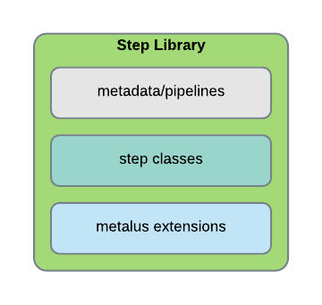

[Documentation Home](readme.md)

# Step Libraries
An application developer requires two things to be able to construct Spark applications:

* [Metalus Application](metalus-application.md) - A self contained jar containing metlaus-core components.
* Step Library - One or more jars containing step functions.

A step library consists of three main components:



## Step Classes
The step library should will contain the [steps](steps.md) which are functions of scala objects. Each function should be
[annotated](step-annotations.md) indicating which functions should be made available for pipelines. Running the
[metadata extractor](metadata-extractor.md) against a step library will scan the annotated objects and functions
to generate the [step templates](step-templates.md) used by developers to create new 
[JSON based pipelines](json-pipelines.md).

## Extensions
A step library may contain additional classes that extend the base Metalus functionality. This topic will be covered
in other documentation.

## Pipelines
[JSON based pipelines](json-pipelines.md) may also be included within a step library. The default _PipelineManager_ will
attempt to locate pipelines within the application configuration file and if not found, will scan the step libraries
**metadata/pipelines** path looking for the pipeline. The pipeline must be in a JSON file with the following naming
convention: ```<pipeline.id>.json```
