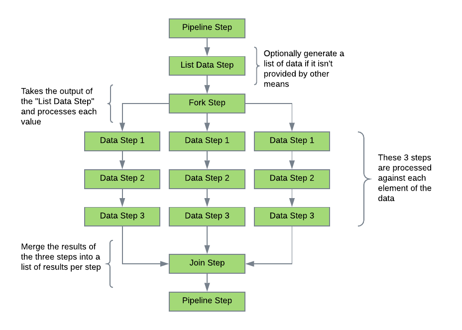

# Steps
The first task when preparing an application to use this project is to ensure that the reusable steps are available. A
project containing common steps is available, but most developers will have requirements to integrate with existing 
libraries and APIs. The application developer should start by creating a project to house these steps. As new 
functionality is identified, a new step function/object will need to be created.

Creating a step is a simple process. A scala object is used to house one or more steps as a logical grouping. Public
functions are then created that act as the step. Function parameters should be defined that will be mapped at runtime 
using the *pipeline* configuration. Care should be taken to ensure that the step function is made as generic as possible
to ensure re-usability. The complexity of the step function is at the discretion of the application developer. An additional
function parameter may be added that does not need to be mapped called *pipelineContext: PipelineContext*. This object
will be injected at runtime and contains information about the current pipeline execution.

Finally, the application developer may choose to add the *StepObject* annotation to the object and the *StepFunction*
annotation to the step function as a way to describe the usage of the step. The *id* should be something unique like a 
GUID. Using the *StepMetaDataExtractor* object, it is possible to convert all known steps to JSON metadata. This feature
currently only works against classes and not against jars.

## Globals
Due to the immutability of the PipelineContext, a step does not have the ability to directly add a global. An indirect 
mechanism is provided using the *namedReturns* of a *PipelineStepResponse* to mark the entries. As each step response
is processed, the *namedReturns* key names are scanned for entries that begin with **"$globals."** and then placed in the
globals object under the key name with the **"$globals."** prefix is stripped off. Existing global values for that key will 
be replaced and a warning logged.

### Fork Join Step Behavior
Steps that update global while in the middle of a fork, will have the results attached to the globals within that fork.
However these global values will not be present in the globals after the join step.

## Step Types
The library provides several step types to make building applications easier.

### Pipeline
This is the most common step type used to perform work in the pipeline. When defining this type of step, the type should
be "Pipeline".

### Branch
The branch type step provides a **decision** point in the flow of a pipeline. This step adds a new parameter type of **result**
that is used to determine the **nextStepId**. The logic in the step function must return a value that may be matched to 
one of the parameters by name. As an example, if there are three *result* type parameters defined ("One", "Two", "Three"),
then the output of the branch step, must be either "One", "Two" or "Three" in order to keep processing. In the case there 
is no match, then processing for that pipeline will stop normally. When defining this type of step, the type should
be "branch".

### Step Group
The step-group type step provides a mechanism for embedding pipelines within another pipeline. This feature is in place
to leverage building smaller reusable pipelines that can be shared across other pipelines. The pipeline will be provided 
with a pipeline context with no pipeline parameters and globals that are only populated with the values from the 
pipelineMappings parameter. There are three parameters for a step-group:

#### pipelineId
This parameter must be a pipeline id that is accessible to the *PipelineManager* within the *PipelineContext*. This
parameter is not required if the **pipeline** parameter is used.

#### pipeline
This parameter is required and can contain either a string with expansion variable or a map with the proper pipeline 
layout. The "className" attribute must be set when using a map. This parameter is not required if the **pipelineId**
parameter is used.

#### pipelineMappings
This optional parameter provides a mechanism for mapping values from the outer pipeline to the globals object accessible 
to the embedded pipeline.

### Fork/Join
The fork and join step types are simple constructs that allow processing a list of data in a loop like construct and then 
joining the results back for further processing.

#### Fork
A fork type step allows running a set of steps against a list of data simulating looping behavior. There are two ways
to process the data: *serial* or *parallel*. Serial will process the data one entry at a time, but all values will be 
processed regardless of errors. Parallel will attempt to run each value at the same time depending on the available 
resources. Fork steps may not be embedded inside other fork steps, but multiple fork steps are allowed as long as a
join step provides separation. Fork steps perform no logic, so the "engineMeta" attribute will be ignored. The required 
parameters are:

* **id** - The id of this step in the pipeline
* **type** - This should always be "fork"
* **params** - Two parameters are required:
  * **forkByValues** - should contain a reference to the list of data to process
  * **forkMethod** - must be either *serial* or *parallel*
* **nextStepId** - This should point to the first step to be used when processing each value.

The first step in the set to be used during fork processing should reference the *id* of the fork step to access the 
data from the list.

#### Join
A join type step is used to **join** the executions of the fork step to continue processing in a linear manner. This step 
type requires a fork step. A join step is not required if all of the remaining steps in the pipeline are to be used to 
process each value in the list. Without a join step, the driver will automatically join the step values and then complete
processing.

Once a join step is encountered, the individual results of the previous steps used for fork processing will be combined 
into a list. The list will wrap the results as options and if there is not a result, *None* will be used. As an example,
if the fork is processing a list containing three elements and the first step returns a boolean based on some criteria, 
then the *primaryReturn* for that step would be a list containing either *None* or *Option[Boolean]*. Each response will 
be stored in the same list position (index) as the data in the original list. The secondary named results will return a 
single map, but the values in the map will be lists which are built identical to the main response.

The join step only requires two parameters:
*  **id** - The id of this step in the pipeline
* **type** - This should always be "join"

Example of a fork/join operation:

