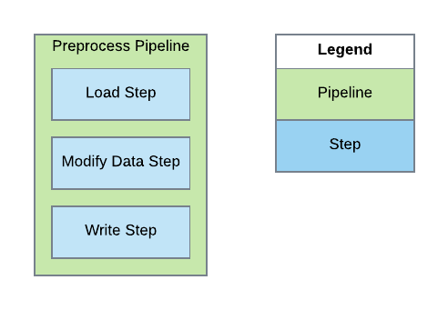
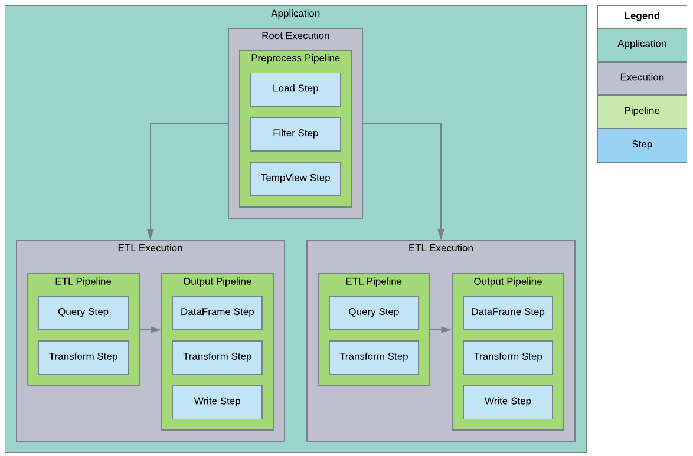

|Branch|Build|Coverage|Quality|
-------|-----|---------|-------|
|Develop||||
|Master||||

# Metalus Pipeline Library
The goal of this project is to make writing [Spark](http://spark.apache.org) applications easier by abstracting the logic
into reusable components that can be compiled into a jar, stored on the cluster and then configured dynamically using
external configurations such as JSON.

## Concepts
This section will attempt to provide a high level idea of how the framework achieves the project goals. Visit 
[metalus-core](metalus-core/readme.md) for more information.

There are several concepts that help achieve the project goal:

### [Steps](metalus-core/docs/steps.md)
The step is the smallest unit of work in the application. A step is a single reusable code function that can be executed
by a pipeline. There are two parts to a step, the actual function and the *PipelineStep* metadata. The function should 
define the parameters that are required to execute properly and the metadata is used by the pipeline to define how those
parameters are populated. The return type may be anything including *Unit*, but it is recommended that a 
*PipelineStepResponse* be returned.

### Pipelines
A pipeline is a collection of steps that should be executed in a predefined order. An application may execute one or 
more pipelines as part of an application and are useful when there may be a need to restart processing in an application
without needing to run all of the same logic again.

### Execution Plan
An execution plan allows control over how pipelines are executed. An [application](metalus-core/docs/application.md) 
may choose to only have a single execution that runs one or more pipelines or several executions that run pipelines in 
parallel or based on a dependency structure.

### Drivers
Drivers are the entry point into the application. The driver is responsible for processing the input parameters and
initializing the *DriverSetup* for the application.

### Driver Setup
Each provided driver relies on the *DriverSetup* trait. Each project is required to implement this trait and pass the
class name as a command line parameter. The driver will then call the different functions to begin processing data. Visit
[metalus-core](metalus-core/readme.md) for more information.

### [Application](metalus-core/docs/application.md)
The *Application* framework is a configuration based method of describing the Spark application. This includes defining 
the execution plan, pipelines, pipeline context overrides (*pipeline listener*, *security manager*, *step mapper*) and 
global values.

## Projects
There are several sub-projects:

### [metalus Pipeline Core](metalus-core/readme.md)
This project contains the core library and is the minimum requirement for any application.

[Maven 2.11 library](https://search.maven.org/search?q=a:metalus-core_2.11)

[Maven 2.12 library](https://search.maven.org/search?q=a:metalus-core_2.12)

### [Metalus Common Pipeline Components](metalus-common/readme.md)
This component contains steps that are considered generic enough to be used in any project.

[Maven 2.11 library](https://search.maven.org/search?q=a:common-pipeline-steps_2.11)

[Maven 2.12 library](https://search.maven.org/search?q=a:common-pipeline-steps_2.12)

### [Metalus AWS](metalus-aws/readme.md)
This component contains AWS specific components. The [Kinesis](https://aws.amazon.com/kinesis/) driver provides a basic 
implementation that gathers data and then initiates the Metalus Pipeline Core for processing of the incoming data.

[Maven 2.11 library](https://search.maven.org/search?q=a:streaming-pipeline-drivers_2.11)

[Maven 2.12 library](https://search.maven.org/search?q=a:streaming-pipeline-drivers_2.12)

### [Metalus Pipeline Examples](metalus-examples/readme.md)
This project provides several examples to help demonstrate how to use the library.

### [Metalus Utilities](metalus-utils/readme.md)
This project provides utilities that help work with the project.

## Examples
Examples of building pipelines can be found in the [pipeline-drivers-examples](metalus-examples/readme.md) project.

## Building
The project is built using [Apache Maven](http://maven.apache.org/).
To build the project using Scala 2.11 and Spark 2.3 run:

	mvn

To build the project using Scala 2.11 and Spark 2.4 run:

	mvn -Dspark.compat.version=2.4 -Djson4s.version=3.5.3 -Dspark.version=2.4.3

To build the project using Scala 2.12 and Spark 2.4 run:

	mvn -Dspark.compat.version=2.4 -Djson4s.version=3.5.3 -Dspark.version=2.4.3 -Dscala.compat.version=2.12 -Dscala.version=2.12.8

(This will clean, build, test and package the jars and generate documentation)

## Running tests
Tests are part of the main build.

## Contributing
* Start by forking the main GutHub [repository](https://github.com/Acxiom/spark-pipeline-driver).
* Commit all changes to the develop branch.
* Create proper scaladoc comments for any new or changed functions.
* Provide a thorough unit test for the change.
* Provide any additional documentation required by individual projects.

