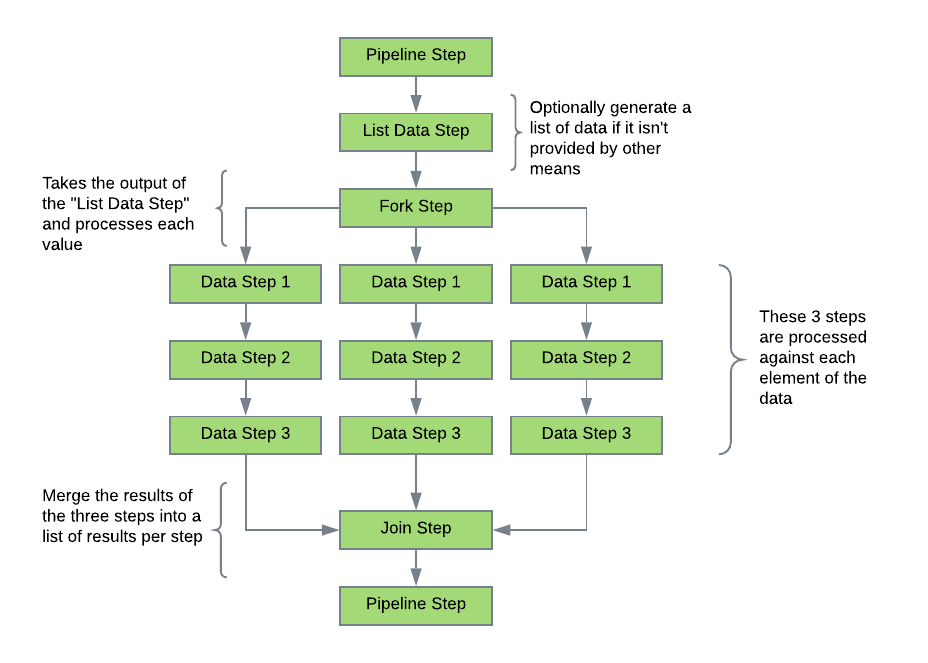

# Steps
The first task when preparing an application to use this project is to ensure that the reusable steps are available. A
project containing common steps is available, but most developers will have requirements to integrate with existing 
libraries and APIs. The application developer should start by creating a project to house these steps. As new 
functionality is identified, a new step function/object will need to be created.

Creating a step is a simple process. A scala object is used to house one or more steps as a logical grouping. Public
functions are then created that act as the step. Function parameters should be defined that will be mapped at runtime 
using the *pipeline* configuration. Care should be taken to ensure that the step function is made as generic as possible
to ensure re-usability. The complexity of the step function is at the discretion of the application developer. An additional
function parameter may be added that does not need to be mapped called *pipelineContext: PipelineContext*. This object
will be injected at runtime and contains information about the current pipeline execution.

Finally, the application developer may choose to add the *StepObject* annotation to the object and the *StepFunction*
annotation to the step function as a way to describe the usage of the step. The *id* should be something unique like a 
GUID. Using the *StepMetaDataExtractor* object, it is possible to convert all known steps to JSON metadata. This feature
currently only works against classes and not against jars.

The library provides several step types to make building applications easier.

## Pipeline
This is the most common step type used to perform work in the pipeline.

## Branch
The branch type step provides a **decision** point in the flow of a pipeline. This step adds a new parameter type of **result**
that is used to determine the **nextStepId**. The logic in the step function must return a value that may be matched to 
one of the parameters by name. As an example, if there are three *result* type parameters defined ("One", "Two", "Three"),
then the output of the branch step, must be either "One", "Two" or "Three" in order to keep processing. In the case there 
is no match, then processing for that pipeline will stop normally.

## Fork
A fork type step allows running a set of steps against a list of data simulating looping behavior. There are two ways
to process the data: *serial* or *parallel*. Serial will process the data one entry at a time, but all values will be 
processed regardless of errors. Parallel will attempt to run each value at the same time depending on the available 
resources. Fork steps may not be embedded in side other fork steps, but multiple fork steps are allowed as long as a
join step provides separation.

## Join
A join type step is used to **join** the executions of the fork step to continue processing in a linear manner. This step 
type requires a fork step. A join step is not required if all of the remaining steps in the pipeline are to be used to 
process each value in the list. Without a join step, the driver will automatically join the step values and then complete
processing.

Example of a fork/join operation:

