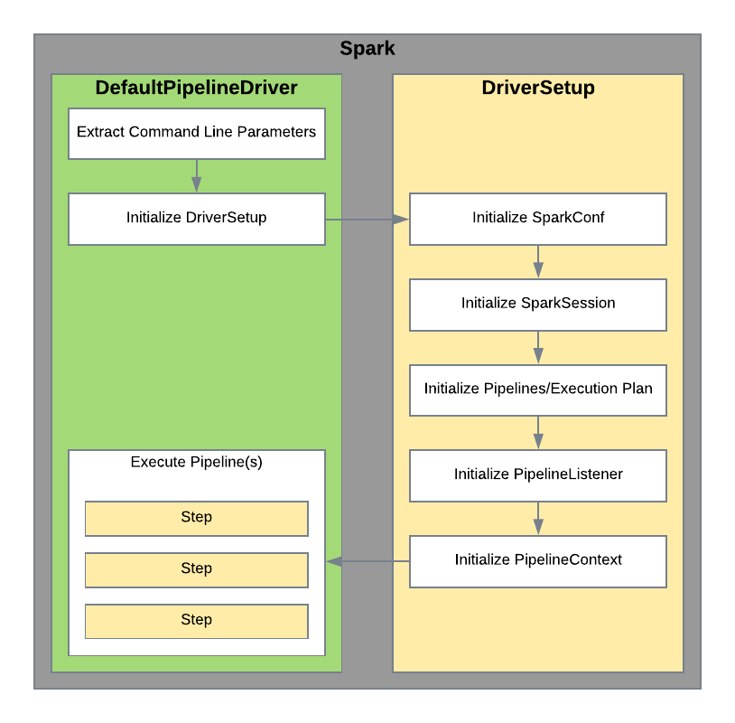

# Spark Pipeline Engine
This project provides the tools necessary for building applications based on reusable components that are assembled at
runtime using external configurations. Using the concepts of *steps* and *pipelines* application developers are able to
deploy a single 'uber-jar' to the cluster and then use the 'spark-submit' command as a gateway to assembling the 
application. Application developers can achieve this by creating reusable *steps* that are packaged in the 'uber-jar' and
one or more *DriverSetup* implementation(s) that is responsible for parsing the external configuration information to 
construct an *execution plan* and *pipelines*.

## Getting Started
There is some preparation and understanding that needs to happen in order to create dynamically assembled applications.

### Utilities
There are some utility libraries provided to make writing steps easier.

#### [FileManager](docs/filemanager.md)
The FileManger utility provides an abstraction of different file systems. Step authors may use this to work directly
with files on different file systems such as HDFS.

#### DriverUtils
This utility provides several functions to help in the creation of a custom *DriverSetup*

### Application
The Application allows application developers the ability to assemble a Spark application by providing a JSON 
configuration file and specifying the *ApplicationDriverSetup* during the call to 'spark-submit'.

Visit the [Application](docs/application.md) document for more information.

### Steps
The first task when preparing an application to use this project is to ensure that the reusable steps are available. A
project containing common steps is available, but most developers will have requirements to integrate with existing 
libraries and APIs. The application developer should start by creating a project to house these steps. As new 
functionality is identified, a new step function/object will need to be created.

Creating a step is a simple process. A scala object is used to house one or more steps as a logical grouping. Public
functions are then created that act as the step. Function parameters should be defined that will be mapped at runtime 
using the *pipeline* configuration. Care should be taken to ensure that the step function is made as generic as possible
to ensure reusability. The complexity of the step function is at the discretion of the application developer. An additional
function parameter may be added that does not need to be mapped called *pipelineContext: PipelineContext*. This object
will be injected at runtime and contains information about the current pipeline execution.

Finally, the application developer may choose to add the *StepObject* annotation to the object and the *StepFunction*
annotation to the step function as a way to describe the usage of the step. The *id* should be something unique like a 
GUID. Using the *StepMetaDataExtractor* object, it is possible to convert all known steps to JSON metadata. This feature
currently only works against classes and not against jars.

### DriverSetup
The next task an application developer must do is create one or more *DriverSetup* implementations. The *DriverSetup*
is invoked by the chosen driver class with a map containing all of the application command line parameters from the
'spark-submit' command. The *DriverSetup* will then be responsible for creating the *SparkSession*, *PipelineContext* and 
execution plan. When executing the 'spark-submit' class, one application parameter is required, *driverSetupClass* which 
is used to initialize the *DriverSetup* implementation.



This flow demonstrates how the chosen driver interacrs with the *DriverSetup*:


There are no special instructions for creating the *SparkSession*. Both the *SparkSession* and *SparkConf* are required
by the *PipelineContext*.

The *PipelineContext* is a shared object that contains the current state of the pipeline execution. This includes all
global values as well as the result from previous step executions for all pipelines that have been executed. In addtiona
to the *SparkSession* and *SparkConf* here are the additional parameters:

* **Global Parameters** - It is recommended that the parameters passed to the *DriverSetup* be used as the initial globals map
* **Security Manager** - Unless the application needs additional security, use the *PipelineSecurityManager* class.
* **Pipeline Parameters** - This object stores the output of executed steps. Basic initialization is: *PipelineParameters(List())* 
* **Step Packages** - This is a list of package names the framework should scan when executing steps. At a minimum it 
should contain *com.acxiom.pipeline.steps*
* **Pipeline Step Mapper** - This object is responsible for pipeline mapping. The default is PipelineStepMapper().  
* **Pipeline Listener** - This object provides a way to track progress within the pipelines. The default is 
instantiation is *DefaultPipelineListener()*. It is recommended that application developers create an implementation
specific to the application.
* **Step Messages** - This is a Spark collection accumulator of *PipelineStepMessage* objects that allow remote executions
to communicate back to the driver. Basic initialization should be 
*```sparkSession.sparkContext.collectionAccumulator[PipelineStepMessage]("stepMessages")```*.

### Pipelines
Pipelines are a collection of steps that are executed in a specified order. Each pipeline contains one or more step 
mappings that will be executed. The pipeline is the most basic construct that can be represented as an external 
configuration. Using the *DriverUtils.parsePipelineJson* function, it is easy to convert a JSON representation into a 
list of *Pipeline* case classes which can then be executed as part of the execution plan.

This diagram describes the flow of an executing pipeline:


#### Pipeline Chaining
Pipeline chaining is the ability to execute more than one pipeline sequentially. When pipelines are chained together, 
the application has the ability to restart a specific pipeline skipping over other pipelines. It must be noted that 
when a restart happens, the pipeline that was restarted and any subsequent pipelines will be executed to completion.

#### Branching
When the flow of the pipeline execution needs to be determined conditionally, a step may be set with a *type* of **branch**.
The return value of the branch should match the name of a parameter in the step params metadata. The value of the matched
parameter will be used as the id of the next step to execute.

#### Conditional Step Execution
Each step has an attribute named *executeIfEmpty* which takes a value just like the parameters of the step. If the value
is empty, then the step will be executed. This is useful in pipeline chaining to aid with sharing resources such as a 
DataFrame. 

This feature is useful for optimizing applications that run multiple pipelines that could benefit from reducing the 
number of times data is read from disk. Consider an application that runs two pipelines, during the execution of the 
first pipeline a DataFrame is created that reads from a parquet table and performs some operations. The second pipeline 
also needs to read data from the parquet table. However, since the second pipeline may be restarted without the first 
pipeline being executed, it will need a step that reads the data from the parquet table. By passing the DataFrame from 
the first pipeline into the *executeIfEmpty* attribute, the step will only be executed if the the DataFrame is missing.
This allows sharing the DAG across pipelines which will also allow Spark to perform optimizations.

#### Flow Control
There are two ways to stop pipelines:

* **PipelineStepMessage** - A step may register a message and set the type of either *pause* or *error* that will prevent
additional pipelines from executing. The current pipeline will complete execution.
* **PipelineStepException** - A step may throw an exception based on the *PipelineStepException* which will stop the
execution of the current pipeline.

#### Exceptions
Throwing an exception that is not a *PipelineStepException* will result in the application stopping and possibly being
restarted by the resource manager such as Yarn. This should only be done when the error is no longer recoverable.

### Execution Plan
The execution plan allows pipelines to execute in parallel and express dependencies between pipelines or groups of 
pipelines. Each *PipelineExecution* in the plan has the ability to execute multiple *pipelines* as well as express
a dependency on other executions. Each execution runs the pipelines as described in the *Pipelines* section above.

When one execution is dependent on another, the *globals* and *parameters* objects will be taken from the final 
**PipelineContext** and injected into the globals object as a map keyed by the id from the parent *PipelineExecution*.
In the map these objects may be referenced by the names *globals* and *pipelineParameters*.

In the event that the result of an execution plan results in an exception or one of the pipelines being paused or errored,
then downstream executions will not run. 

Below is an example of an execution plan demonstrating a single root pipeline chain that has three child dependencies.
A final pipeline chain has a dependency on two of the three child pipeline chains. In this example, pipeline chain *A* will
execute first. Once it is complete, then pipeline chains *B*, *C* and *D* can be executed in parallel depending on resources
available. The final pipeline chain *E* will only execute once both *B* and *D* have completed successfully.:


This next diagram shows how an execution plan is processed:


## Pipeline Step Mapping
*Pipelines* represent the reusable construct of the application. In order to abstract the pipeline definition in a way that
allows reuse without having to duplicate the metadata, this library has the concept of pipeline step mapping. The pipeline
is constructed from *PipelineStep* objects that contain the *id* of the step to execute and a list of parameters that
will be mapped to the step function at runtime. 

This flow demonstrates the mapping flow:


Special characters are allowed in the *value* of the parameter that the executor will use to determine where to pull 
the mapped value. The value may be static or dynamic. Below is a list of characters to use when the value should be 
dynamic:

* **!** - When the value begins with this character, the system will search the PipelineContext.globals for the named parameter and pass that value to the step function.
* **$** - When the value begins with this character, the system will search the PipelineContext.parameters for the named parameter and pass that value to the step function.
* **@** - When the value begins with this character, the system will search the PipelineContext.parameters for the named parameter and pass the primaryReturn value to the step function.
* **#** - When the value begins with this character, the system will search the PipelineContext.parameters for the named parameter and pass the namedReturns value to the step function.

The **@** and **#** symbols are shortcuts that assume the value in PipelineContext.parameters is a PipelineStepresponse.
 
In addition to searching the parameters for the current pipeline, the user has the option of specifying a pipelineId in 
the syntax for *@* and *$* to specify any previous pipeline value. *Example: @p1.StepOne*

Values may also be embedded. The user has the option to reference properties embedded in top level objects. Given an 
object (obj) that contains a sub-object (subObj) which contains a name, the user could access the name field using this
syntax:

	$obj.subObj.name
	
Here is the object descried as JSON:

	{
		"subObj": {
			"name": "Spark"
		}
	} 

### PipelineStep
The PipelineStep describes the step functions that need to be called including how data is passed between steps. When 
creating a PipelineStep, these values need to be populated:

* **id** - This is the step id. This should be unique for the step within the pipeline. This id is how other steps can reference the result of executing the step or how to indicate which step to execute next in the pipeline.
* **displayName** - This is used for logging purposes.
* **description** - This is used to explain what the step is for. When step metadata is stored as another format such as JSON or XML, the description is useful for display in a UI.
* **type** - This describes the type of step and is useful for categorization. Most steps should default to *Pipeline*. There is a *branch* type that is used for branching the pipeline conditionally.
* **params** - This is a list of **Parameter** objects that describe how to populate the step function parameters. 
* **engineMeta** - This contains the name of the object and function to execute for this step. The format is *StepObject.StepFunction*. Note that parameters are not supplied as the *params* attribute handles that.
* **nextStepId** - Tells the system which step to execute next. *branch* steps handle this differently and passing in *None* tells the system to stop executing this pipeline.
* **executeIfEmpty** - This field is used to determine if the current step should execute. Passing in a value skips execution and returns the value as the step response. Fields can use any values that are supported by *params*.
